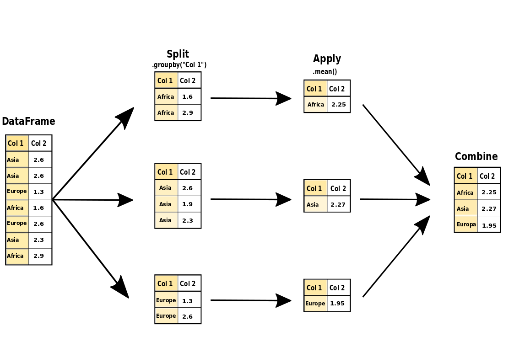

Aggregation
===========

Die Funktion ``DataFrame.groupby()`` ist sehr mächtig, um Daten zusammenzufassen.
Die Logik besteht aus drei Schritten: **Split-Apply-Combine**.

- **Split** : die Daten werden nach einem Kriterium in Gruppen zerlegt.
- **Apply** : eine Aggregatfunktion wird auf jeder Gruppe ausgeführt.
- **Combine** : die Ergebnisse werden in ein neues DataFrame gepackt.

Beispiele
---------

.. literalinclude:: example.py

.. seealso::

   eine ausführlicheres Kapitel findet sich auf `pandas go to space <https://krother.github.io/pandas_go_to_space/aggregation/README.html>`__
