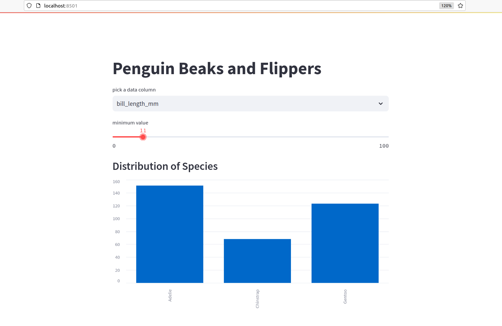

Streamlit Intro
===============

|image0|

Mit **Streamlit** kannst Du ein eigenes Dashboard mit Deinen Plots im Browser anzeigen lassen.
Hier findest Du ein Rezept, um Streamlit einzurichten.

In der Datei :download:`penguin_dashboard.py` findest Du ein komplettes Beispiel.

Schritt 1: Streamlit installieren
---------------------------------

Öffne ein Terminal.
Unter Windows, verwende dazu den **Anaconda Prompt**.
Suche nach **Anaconda Prompt** im Startmenü.

Gib ein:

::

   pip install streamlit

.. hint::

   Das Installieren über die Anaconda Oberfläche hat nicht funktioniert.
   Außerdem brauchen wir das Terminal noch, also lass es offen.

Schritt 2: Hallo-Welt-Beispiel
------------------------------

Erstelle eine neue Python-Datei, z.b. ``dashboard.py``.
Kopiere folgenden Code hinein:

.. code:: python3

   import streamlit as st

   st.write("# Hallo Welt")

Speichere das Programm ab.

Schritt 3: Dashboard-Server starten
-----------------------------------

Nun musst du in das Verzeichnis mit der Python-Datei wechseln.
Gib im Terminal ``cd`` einen Befehl ähnlich diesem ein:

::

   cd C:\Users\Kristian\Projekte

Du kannst den Verzeichnisnamen auch aus dem Datei-Explorer kopieren.
Mit ``dir`` kannst du dir die Dateien im aktuellen Verzeichnis anzeigen
lassen. Sobald du die Datei ``dashboard.py`` siehst, starte den Server
mit:

::

   streamlit run dashboard.py

Es sollte ein Browser aufgehen, in dem du die *Hallo Welt*-Nachricht
siehst.

Schritt 4: Daten anzeigen
-------------------------

Probiere das nächste Beispiel aus:

.. code:: python3

   import streamlit as st
   import pandas as pd

   df = pd.DataFrame({
     'first column': [1, 2, 3, 4],
     'second column': [10, 20, 30, 40]
   })    
   st.write(df)

Speichere das Programm und refreshe den Browser.
Nun solltest du eine Tabelle sehen.

.. seealso::

   `docs.streamlit.io/library/get-started <https://docs.streamlit.io/library/get-started>`__

