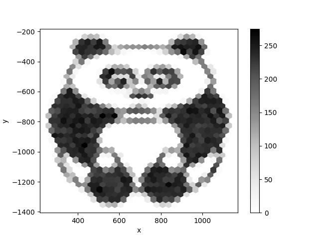

Datenvisualisierung
===================

*von Kristian Rother*

Hier findest Du das Begleitmaterial zu meinem Kurs "Datenvisualisierung".
Du findest hier Du einfache Befehlsfolgen, um mit Python Daten einzulesen,
Diagramme zu erzeugen und ein Dashboard zu erzeugen.

Das Material ist für Leute mit wenig Programmiererfahrung konzipiert.
Solte es doch einmal nicht einfach sein, schreibe mir gerne eine e-Mail (`kristian.rother@posteo.de`).

Vorbereitung
------------

.. toctree::
   :maxdepth: 1

   vorbereitungen ana jupy spy git
   preparations/README.rst
   data_sources

Daten in Python
---------------

.. toctree::
   :maxdepth: 1

   read_write_data/README.rst
   select_rows_and_columns/README.rst
   aggregation/README.rst
   pivot/README.rst
   inspect_data_frames/README.rst
   descriptive_statistics/README.rst
   time_series/README.rst

Diagramme erstellen
-------------------

.. toctree::
   :maxdepth: 1

   plotting/README.rst
   balk
   streu
   box
   histo
   lini
   heat
   choro
   marker
   plotting_maps/README.rst
   finetunig axes
   als png spei
   ani gif

Dashboards
----------

.. toctree::
   :maxdepth: 1

   streamlit
   dashboard
   slider
   layout + tabs
   markdown
   unterseiten
   cloud deploy

Anhang
------

.. toctree::
   :maxdepth: 1

   projekt.rst
   links.rst

Übungsprojekte
--------------

.. toctree::
   :maxdepth: 1

   babynames/read_data.rst
   babynames/timeline.rst
   babynames/last_letters.rst
   klimastreifen/README.rst
   titanic/README.rst
   gapminder/README.rst
   
Lizenz
------

© 2023 Kristian Rother

Unless stated otherwise, the content of this tutorial may be used under the conditions of the **Creative Commons Attribution Share-Alike License 4.0 (CC-BY-SA 4.0)**. 
See `creativecommons.org <https://creativecommons.org/licenses/by-sa/4.0/>`__ .

Acknowledgements
----------------

Die folgenden Personen haben zur Entstehung dieser Materialien beigetragen: Jasmin Touati, Veit Schiele, Dinu Gherman, Pedro Fernandes, Tomasz Puton, Edward Jenkins, Bernard Szlachta, Robert Lehmann, Allegra Via, Kaja Milanowska, Anna Philips, Paul Wlodkowski, Tom Gadsby, Stefan Roth, Gesa Johannsen, Ugur Ural, Malte Bonart, Paula Gonzalez, Samuel McGuire, Sara Maras, Carmine Somma, Kiran Challa, Dina Deifallah, Marija Vlajic, Emely Henninger und Magdalena Rother.