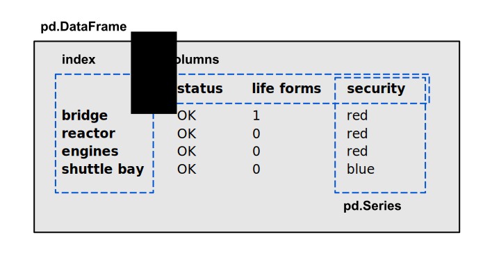

DataFrames untersuchen
======================

Die Klasse `pandas.DataFrame` ist die zentrale Datenstruktur in `pandas`.
Im Wesentlichen ist es eine Tabelle mit Spaltennamen und Zeilennamen.
Diese werden auch als `Index` bezeichnet.
Jede Spalte hat den Tup `pandas.Series`.

Hier findest Du einige Befehle, mit denen Du prüfen kannst, was ein DataFrame enthält.

.. hint::

   In **Spyder** kannst Du auch den **Varible Explorer** verwenden.
   Falls Du die hier vorgestellten Befehle außerhalb von Jupyter verwendest, musst Du eine ``print()``-Anweisung um den jeweiligen Befehl packen.

Einige Zeilen inspizieren
-------------------------

Um einfach nur zu sehen, wie ein DataFrame aussieht, kannst Du in Jupyter den Namen der Variable eingeben.
In einem Python-Skript mußt Du ``print(df)`` verwenden.
Mit den Funktionen `head()` und `tail()` kannst Du bestimmen, wie viel Du sehen möchtest:

.. code:: python

   df.head(3)
   df.tail(3)

Anzahl der Zeilen und Spalten
-----------------------------

Das Attribut ``shape`` eines `DataFrame` ist ein Tupel aus zwei Zahlen `(Zeilen, Spalten)`.

.. code:: python

   df.shape

.. dropdown:: Wann sollte ich `df.shape` verweden?
   :animate: fade-in

   `df.shape` ist der wichtigste Befehl um pandas-Code zu debuggen.
   Wenn die Anzahl Zeilen oder Spalten nicht ist, was Du erwartest, funktioniert normalerweise alles andere auch nicht.
   

Datentypen
----------

Wenn Du Daten aus einer CSV-Datei lädst, erkennt `pandas` die Datentypen automatisch.
Manchmal ist das nicht so gut, z.B. wenn eine numerische Spalte einen einzelnen String enthält.

.. code:: python

   df.dtypes

.. dropdown:: Was bedeutet der Typ `object`?
   :animate: fade-in

   Der Typ `object` tritt meist bei Spalten mit Strings auf.

Eine generelle Übersicht kannst Du auch mit folgender Funktion erhalten:

.. code:: python

   df.info()

Eindeutige Werte
----------------

Bei kategorischen Spalten ist es oft interessant, wie oft einzelne Werte vorkommen.
Aus dem Ergebnis der Funktion kannst Du auch leicht eine Balkengrafik erstellen.

.. code:: python

   df['column_name'].value_counts()

Falls Dich die Zahlen nicht interessieren, erhälst Du alle eindeutigen Werte mit:

.. code:: python

   df['column_name'].unique()
