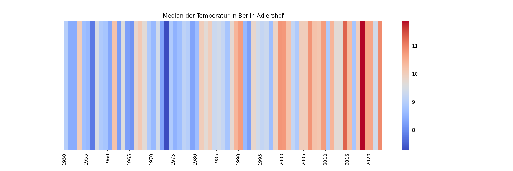

Klimastreifen
=============

In dieser Übung reproduzieren wir das berühmte Titelbild mit den
`Klimastreifen im Economist <https://www.economist.com/leaders/2019/09/19/the-climate-issue>`__.

|image0|

Schritt 1: Lade Klimadaten von ECAD herunter
--------------------------------------------

-  gehe auf `www.ecad.eu <https://www.ecad.eu>`__
-  gehe auf *“Daily data”*
-  klicke auf *“Custom query (ASCII)”*
-  setze die Felder wie in der Tabelle angegeben:

============== =====================
Feld           Wert
============== =====================
Type of series blend
Country        ``ein Land``
Location       ``eine Stadt``
Element        Mean temperature
============== =====================

Drücke anschließend auf *“Next”* und *“Download”*

Du solltest jetzt eine ZIP-Datei mit einer Tabelle in einem Textformat erhalten.

.. warning::

   Die ECAD-Daten sind zur öffentlichen Nutzung freigegeben.
  Allerdings ist es nicht erlaubt, die Rohdaten weiter zu verteilen
  (auf GitHub o.ä.).

Schritt 2: Lies die Daten in pandas ein
---------------------------------------

Die ECAD-Daten in pandas einzulesen ist etwas kniffliger als bei einer
handelsüblichen CSV-Datei. Du musst die Datei in einem Texteditor inspizieren
(auf keinen Fall in Excel).
Achte auf folgendes:

-  wodurch sind die Spalten getrennt?
-  gibt es eine Kopfzeile mit Spaltennamen?
-  wie viele Zeilen enthalten Kommentare bevor die eigentlichen Daten anfangen?

Lies nach, welche Parameter `pd.read_csv() <https://pandas.pydata.org/pandas-docs/stable/reference/api/pandas.read_csv.html>`__ annimmt.
Du benötigst insgesamt drei:

.. code:: python3

    df = pd.read_csv(..., ..., ...)

Vermutlich enthalten die Spaltennamen danach noch Leerzeichen.
Das kannst du in Ordnung bringen mit:

.. code:: python3

    df.columns = ['SOUID', 'DATE', 'TG', 'Q_TG']

Schritt 3: Datenaufbereitung
----------------------------

Die Spalte **TG** enthält die Temperatur in Schritten von 0.1 Grad Celsius.
Das wurde vermutlich zu einer Zeit festgelegt, als Festplatten noch teuer waren.
Ganze Zahlen verbrauchen weniger Speicher.

Erstelle eine neue Spalte, in der die Temperatur durch 10 geteilt wird.
Wähle einen Namen für die neue Spalte:

.. code:: python3
   
    df[...] = df["TG"] ...

Erstelle ein **Liniendiagramm** der rohen Temperaturdaten:

.. code:: python3

    df[...].plot()

Schritt 4: Zeitachse
--------------------

Dis Spalte ``DATE`` enthält Zeitstempel im Format ``YYYYMMDD``.
Diese sollten wir in pandas *timestamps* umwandeln.

Zunächst wandeln wir die Zahlen in der Spalte in Strings um:

.. code:: python3
   
    df['datum'] = df['DATE'].astype(str)

Anschließend knipsen wir Jahr, Monat und Tag ab:

.. code:: python3
   
   df['jahr'] = df['datum'].str[0:4]
   df['monat'] = ...
   df['tag'] = ...

Schließlich erstellen wir eine neue Spalte mit Bindestrichen.
Pandas kann diese in Zeitstempel im Format **YYYY-MM-DD** umwandeln.
Die fertigen Daten verwenden wir als Index:

.. code:: python3
   
   zeitstempel = df['jahr'] + '-' + df['monat'] + '-' + df['tag']
   datum = pd.to_datetime(zeitstempel)
   df = df.set_index(datum)

Plotte die Temperatur wieder als Liniendiagramm.
Die x-Achse sollte jetzt viel besser aussehen.

Schritt 5: Fehlende Werte
-------------------------

In einigen Städten fehlen Messwerte.
In der Datei steht dann der Wert ``-9999``.
Mit ``replace()`` können wir dort etwas anderes einfügen.
Berechne den Median als sinnvollen Ersatz:

.. code:: python3
   
   median = ...
   df['temp_fixed'] = df[...].replace(-999.9, median)

Plotte die Daten in der Spalte `temp_fixed` erneut.

Schritt 6: Schneide das letzte Jahr ab
--------------------------------------

Das letzte Jahr in den Daten ist unvollständig.
Wenn du über ganze Jahre mitteln möchtest,
sollten wir das letzte Jahr loswerden:

.. code:: python3
   
    df = df.loc[:'2022-12-31']

Schritt 7: Aggregation
----------------------

Jetzt läßt sich für jedes Jahr der Median der Temperatur mit ``df.groupby()`` ermitteln:

.. code:: python3
   
   median = df.groupby('jahr')['temp_fixed'].median()

Allerdings ist das Ergebnis mit ``df.resample()`` etwas flexibler.
So behalten wir *Zeitstempel im Index*, und die x-Achse im Plot sieht hübscher aus.

.. code:: python3
   
   median = df.resample('Y')[...].median()

Plotte das Ergebnis noch einmal.

Schritt 8: Heatmap
------------------

Du kannst die Heatmap-Funktion aus der Bibliothek ``seaborn`` verwenden, um Streifen zu erzeugen:

.. code:: python3
   
   daten = pd.DataFrame(median)
   cmap = plt.get_cmap('coolwarm')

   plt.figure(figsize=(15, 5))
   plt.title('Median der Temperatur in ...')
   sns.heatmap(daten, cmap=cmap, cbar=False, yticklabels=[], xticklabels=[])
   plt.savefig('klimastreifen.png', dpi=150)

.. hint:: 
   
   Wenn du in den Namen **coolwarm** einen Tippfehler einbaust, zeigt Python eine Liste von Farbskalen an.

Weiterführendes Material
------------------------

* `Time Series auf pandas go to space <https://krother.github.io/pandas_go_to_space/time_series/README.html>`__
