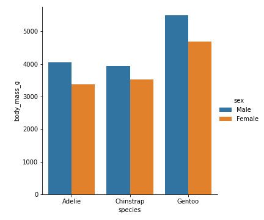

Balkendiagramme
===============

Ein Barplot ist oft das einfachste Diagramm um Daten zusammenzufassen.
Es funktioniert als Einzeiler mit pandas:

.. code:: python3

   df.groupby("species")["body_mass_g"].mean().plot.bar()

Etwas ansehnlicher wird es mit `seaborn`:

.. code:: python3

    sns.barplot(
        data=df, 
        x="species",
        y="body_mass_g",
        estimator="mean",
        errorbar=None,
    )

:download:`[Beispielskript zum Download] <barplot.py>`

Balkengruppen
-------------

Mit zwei Kategorien lassen sich Balkengruppen bilden.
Hier der Einzeiler mit `pandas`:

.. code:: python3

   df.groupby(["species", "sex"])["body_mass_g"].mean().unstack().plot.bar()

Mit `seaborn` ist die Notation deutlich weniger sperrig:

.. code:: python3

    sns.catplot(
        data=df, 
        x="species",
        y="body_mass_g",
        hue="sex",
        kind="bar",
        estimator="mean",
        errorbar=None,
    )

:download:`[Beispielskript zum Download <grouped_barplot.py>`

Streudiagramme
==============

Zwei numerische Variablen lassen sich mit Streudiagrammen darstellen:

.. code:: python3

    df.plot.scatter(x="flipper_length_mm", y="body_mass_g")

Während `pandas` ohne größere Mühe nur einfarbige Plots hinbekommt, erlaubt `seaborn` die Angabe des Parameters `hue`:

.. code:: python3

    sns.scatterplot(
        data=df, 
        x="flipper_length_mm",
        y="body_mass_g",
        hue="sex",
    )

:download:`[Beispielskript zum Download] <scatterplot.py>`

Box-Plots
=========

Mit einem Box-Plot (ursprünglich *box-and-whisker-plot*) seht Ihr Minimum, Maximum, Median und Quartile auf einmal.

.. code:: python3

    sns.boxplot(
        data=df,
        y="body_mass_g",
        x="species",
    )

.. hint::

    Du kannst durch Hinzufügen von ``hue="sex"`` Gruppen von Boxplots erzeugen.

Die `.plot.box()` Funktion aus `pandas` ist weitgehend nutzlos und wird hier gar nicht erst gezeigt.

:download:`[Beispielskript zum Download] <boxplot.py>`

Histogramme
===========

Histogramme zeigen Verteilungen einer numerischen Spalte.
Es ist in der Praxis wichtig, mehrere Werte für ``bins`` auszuprobieren.

.. code:: python3

   df["body_mass_g"].plot.hist(bins=20)

Mit `seaborn` sieht der Plot besser aus.
Es kann ausserdem eine Ausgleichslinie (*kernel density estimator*) gezeichnet werden.

Werden mehrere Teildatensätze in ein Histogramm geplottet, hat das oft unerwünschte Nebeneffekte.
Hier ein Beispiel mit zwei von drei Pinguin-Spezies:

.. code:: python3

    no_chin = df[df["species"]!="Chinstrap"]
    sns.histplot(
        data=no_chin, 
        x="body_mass_g",
        hue="species",
        bins=20,
        kde=True,
        alpha=1.0,
    )

.. warning::

   Die Histogramme im Beispiel überlappen sich, weshalb nicht alles zu sehen ist.
   In der Praxis ist es sicherer, nur eine Variable pro Histogramm darzustellen.

:download:`[Beispielskript zum Download] <histogramm.py>`

Liniendiagramme
===============

Ein Liniendiagramm macht meist nur bei Zeitreihen Sinn.
Dafür sind Zeitreihen auch sehr häufig.
`pandas` bekommt Liniendiagramme sehr gut selbst hin:

.. code:: python3

    df = sns.load_dataset("seaice")     # anderer Datensatz
    df.set_index("Date", inplace=True)  # Index-Spalte setzen
    df = df.loc["2000-01-01":]          # Werte ab 1.1.2000

    df.plot()
    plt.ylim(0, 18)                     # y-Achse formatieren

.. warning::

    Bei einer Zeitreihe sollten die Zeitstempel (Datum/Uhrzeit) unbedingt in der Index-Spalte liegen,
    dann wird die x-Achse automatisch sauber formatiert.

:download:`[Beispielskript zum Download] <lineplot.py>`

Heatmap
=======

Eine Heatmap eignet sich zur Darstellung von allerlei Pivot-Tabellen und anderer Matrizen.
Häufig verwendet wird sie, um **Korrelationskoeffizienten** darzustellen:

.. code:: python3

   corr_mtx = df.corr()
   
   plt.figure(figsize=(10, 9))
   sns.heatmap(
       data=corr_mtx,
       annot=True,
       vmin=-1.0,
       vmax=1.0,
       cmap="coolwarm",
       )

.. hint::

   Bei umfangreichen Tabellen mußt Du die Größe des Diagramms erhöhen, damit die Beschriftung Platz findet.

.. seealso::

   Die Namen von Farbskalen stehen auf `https://matplotlib.org/stable/users/explain/colors/colormaps.html <https://matplotlib.org/stable/users/explain/colors/colormaps.html>`__ .    

:download:`[Beispielskript zum Download] <heatmap.py>`

Streudiagramm-Matrix
====================

Mit der `pairplot`-Funktion läßt sich *jede numerische Variable gegen jede andere* plotten.
Diese Funktion ist sehr nützlich, um sich einen ersten Eindruck zu verschaffen.
Auf der Diagnoalen sind zusätzlich Histogramme angezeigt

.. code:: python3
   
   sns.pairplot(df, hue="species")

.. warning::

   Führe diese Funktion niemals für mehr als 10 Spalten aus,
   sonst wird das Programm nie fertig.

:download:`[Beispielskript zum Download] <pairplot.py>`
