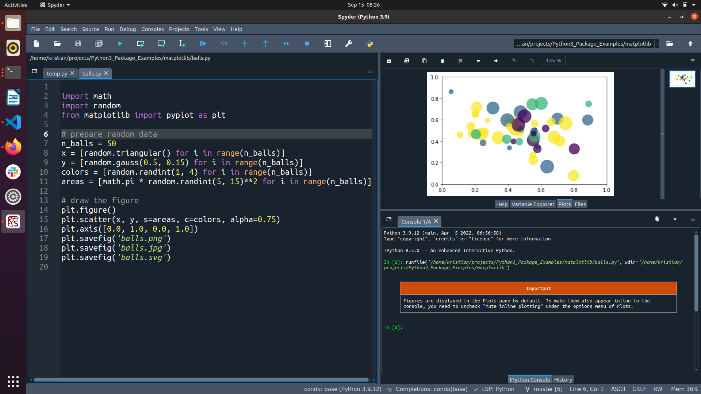

Python Installieren
===================

Den Editor Spyder verwenden
~~~~~~~~~~~~~~~~~~~~~~~~~~~

Schritt 1: Anaconda
-------------------

Installiere Python. 
Empfohlen und unterstützt ist die `Anaconda Distribution <https://www.anaconda.com/download>`__

Lade die frei verfügbare Version für Dein Betriebssystem herunter.
Die Installation kann ein wenig dauern.

Aufgabe 2: Spyder starten
-------------------------

1. Starte Anaconda. Unter Windows erscheint ein grüner Ring.
2. Nach ca. 1 Minute erscheint ein Menübildschirm (der Anaconda Navigator)
3. Wähle “Spyder”. Es erscheint ein Editorfenster

Aufgabe 3: ein Programm ausführen
---------------------------------

1. Schreibe ``print("Hello World")`` in den Editor links.
2. Drücke den dreieckigen **“Play”** Knopf oben
3. Es sollte der Text *“Hello World”* rechts unten erscheinen.

**Herzlichen Glückwunsch, Python läuft jetzt bei Dir. Du hast den ersten
Schritt in eine größere Welt gemacht!**

Aufgabe 4: Plots
----------------

Führe eines der Python-Skripte auf
`https://github.com/krother/datenvisualisierung/tree/main/plotting <https://github.com/krother/datenvisualisierung/tree/main/plotting>`__
aus.

1. Klicke auf eine der ``.py``-Dateien
2. Kopiere den gesamten Code ins Spyder-Editorfenster
3. Führe den Code aus
4. Drücke auf **Plots** rechts im Bildschirm, um die Abbildung zu sehen
5. Verändere einige der Zahlen

Es sollte etwa so wie im Bild aussehen:

Jupyter verwenden
~~~~~~~~~~~~~~~~~

Schritt 1: Anaconda installieren
--------------------------------

wie oben

Schritt 2: Jupyter starten
--------------------------

Anstelle von **Spyder** kannst Du auch Jupyter Notebooks verwenden.
Starte dazu **Jupyter** aus dem **Anaconda Navigator**.
Jupyter läuft daraufhin als HTTP-Server im Hintergrund.

Es sollte sich ein Browserfenster öffnen.
Erstelle durch Drücken auf den Knopf **New** (oben rechts) ein neues Python3-Notebook.
Du kannst sofort loslegen.

Schritt 3: Import-Anweisungen
-----------------------------

Prüfen wir einmal nachk, ob die wichtigsten Bibliotheken schon installiert sind.
Schreibe in eine leere Codezelle:

.. code:: python3

    import pandas as pd
    import numpy as np
    import seaborn as sns
    from matplotlib import pyplot as plt

Führe die Befehle mit dem dreieckigen **Play**-Knopf aus.
Du solltest eine leere Ausgabe und ein neues Eingabefeld sehen können.
Falls Du keine Fehlermeldung siehst, hat alles geklappt.

Fahre mit Schritt 4 aus dem Rezept weiter oben fort.

Tastaturkürzel
--------------

Hier sind einige nützliche Kürzel für Juptyer:

================ ==========================
Tasten           Beschreibung  
================ ==========================
`Shift + Enter`  eine Codezelle ausführen
`Escape + A`     Zelle darüber einfügen
`Escape + B`     Zelle darunter einfügen
`Escape + X`     aktuelle Zelle löschen
`Tab`            Autovervollständigung
`Shift + Tab`    Kontext-sensitive Hilfe
================ ==========================

Bibliotheken selbst installieren
~~~~~~~~~~~~~~~~~~~~~~~~~~~~~~~~

Falls Du bereits eine aktuelle Python-Installation auf Deinem System installiert hast, einen professionellen Texteditor wie VS Code bedienen kannst
und Dich vielleicht schon etwas mit Python auskennst, möchtest Du möglicherweise die für den Kurs nötigen Bibliotheken von der Kommandozeile selbst installieren.

Mit `pip` kannst Du das mit einem einzigen Befehl tun:

.. code::

    pip install --upgrade pandas numpy seaborn matplotlib
