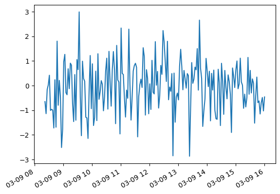

Zeitreihen
==========

Das Verarbeiten von Zeitreihen ist eine der größten Stärken von ``pandas``.
Meist sollten Zeitstempel im **Zeilenindex** liegen.

Zeitstempel erstellen
---------------------

Die Funktion :py:func:`pandas.date_range` erstellt Zeitstempel für Datumsbereiche:

.. code:: python3

    import pandas as pd
    import numpy as np

    numbers = np.random.randint(1, 100, size=200)

    s = pd.Series(
        data = numbers,
        index = pd.date_range("2023-03-09", freq="D", periods=200),
        name = "random_data",
    )
    s.head()

Anstelle einer ``pd.Series`` könntest Du auch ein DataFrame mit mehreren Spalten erstellen
oder mit ``df.set_index()`` den Index eines bestehenden DataFrame setzen.
In beiden Fällen wird ein ``pandas.DateTimeIndex`` erstellt.

Du kannst auch Zeitstempel mit beiden Endpunkten und einer festgelegten Anzahl Zeitpunkten dazwischen erstellen:

.. code:: python3

    pd.date_range("2023-03-09 08:22:00", "2023-03-09 16:00:00", periods=200),

Strings in Zeitstempel umwandeln
--------------------------------

Strings lassen sich recht bequem in Zeitstempel umwandeln.
``pandas`` versteht zahlreiche Formate:

.. code:: python3

    pd.to_datetime(
        ["2020", "September 16th, 2020", "2020 Sep 16 11:11", "2020/09/16", "09/16/2020"],
        day_first=False
    )

.. note::

   Beim Einlesen aus einer CSV-Datei ist das Argument ``parse_dates=True`` oft sinnvoll.

Zeitreihen plotten
------------------

Beim Plotten von Zeitreihen verwendet ``pandas`` automatisch den Zeitindex als x-Achse:

.. code:: python3

    s.plot()

Attribute von Zeitstempeln
--------------------------

Jeder **DateTimeIndex** enthält eine Reihe nützlicher Felder:

.. code:: python3

    s.index.year
    s.index.month
    s.index.hour
    s.index.weekday
    s.index.minute
    s.index.month_name()
    s.index.day_name()

Datumsbereiche
--------------

Zeitindizes können über String-Intervalle geteilt werden:

.. code:: python3

    s['1/10/2011']
    s["2023-03-20":"2023-04-17"]
    s[datetime(2011, 1, 7):]
    s['1/6/2011':'1/11/2011']

Resampling
----------

Eine häufige Aufgabe ist die Zeilen so zu ändern, dass die Zeitstempel in regelmäßigen Abständen stehen.
Dies nennt man **resampling**. Es gibt zwei Arten davon.

Beim **Downsampling** werden die Daten kondensiert, so dass es weniger Zeilen sind.
Wie bei ``df.groupby()`` benötigst Du eine Aggregatfunktion zum Zusammenfassen der Daten:

.. code:: python3

    s.resample("1M").mean()
    s.resample("2W").sum()
    s.resample("10d").first()

Dagegen werden beim **Upsampling** zusätzliche Zeilen eingefügt.
Die Lücken zwischen den vorher bekannten Zeitpunkten können unterschiedlich aufgefüllt werden:

.. code:: python3

    s.resample("6h10min").first()
    s.resample("6h10min3s").ffill()
    s.resample("6h").first().interpolate()

.. seealso::

   Es gibt eine Tabelle mit der Notation für Zeitintervalle in der `pandas Time Series Dokumentation <https://pandas.pydata.org/pandas-docs/stable/user_guide/timeseries.html#offset-aliases>`__

Gleitender Mittelwert
---------------------

Eine häufige Aggregation ist der gleitende Mittelwert (rolling mean, moving average).
Dabei läuft ein Zeitfenster mit einer bestimmten Anzahl Datenpunkte über die Zeitreihe.
Aus allen Werten im Fenster wird der Mittelwert berechnet.
Dadurch wird Rauschen in den Daten gelättet.

.. code:: python3

    s.rolling(window=10).mean()
    s.rolling(window=10).std()
    
    s.rolling(window=10).mean().plot()

Probiere unterschiedliche Fensterbreiten um zu sehen wie sich die Glättung verändert.

.. seealso::

   Weitere Beispiele gibt es in der `pandas Dokumentation <https://pandas.pydata.org/pandas-docs/stable/timeseries.html>`__
